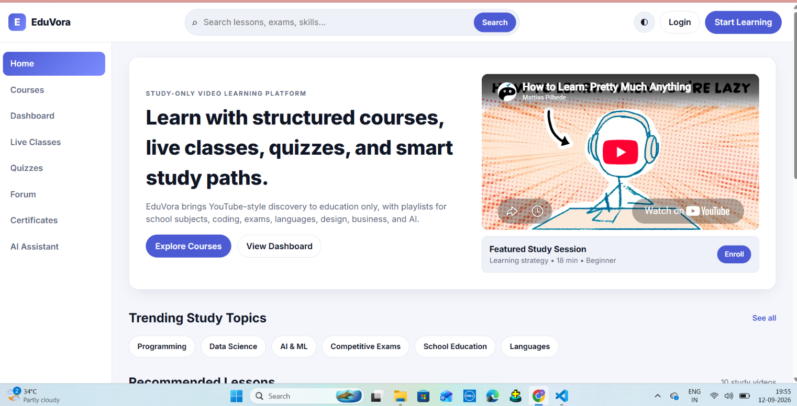
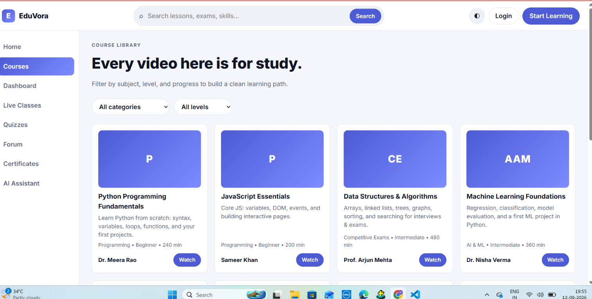
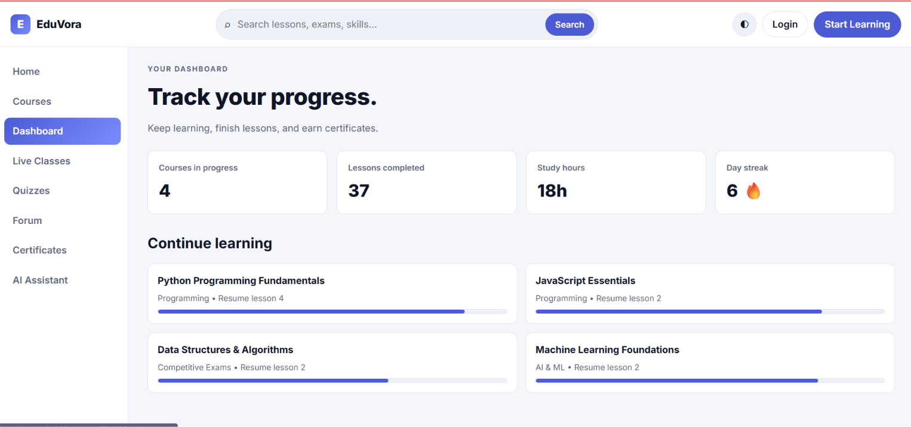

# 🎓 EduVora — Study Video Learning Platform

EduVora is a modern **study-focused video learning platform** designed to make online education organized, interactive, and engaging.

It provides students with a dedicated space to discover educational content, follow structured courses, attend live classes, take quizzes, track their learning progress, participate in discussions, earn certificates, and get assistance from an AI study assistant.

🔗 **Live Website:** https://soniyashaik29.github.io/EDUVORA/

---

## 📸 Screenshots

### 🏠 Home Page

The EduVora homepage introduces the platform and provides quick access to courses, learning resources, live classes, quizzes, and other study features.



---

### 📚 Course Library

The Course Library allows learners to explore educational videos and organize their learning based on subjects and levels.



---

### 📊 Student Dashboard

The dashboard helps students track their learning progress, completed lessons, study hours, courses in progress, and learning streak.



---

## ✨ Features

* 🎥 **Study Video Learning**

  * Educational videos organized for focused learning
  * Structured learning paths
  * Recommended lessons

* 📚 **Course Library**

  * Browse educational courses
  * Filter learning content by subject and level
  * Continue learning from where you stopped

* 📊 **Learning Dashboard**

  * Track courses in progress
  * Monitor completed lessons
  * Track study hours
  * Maintain learning streaks

* 🔴 **Live Classes**

  * Join live study sessions
  * View upcoming classes
  * Set reminders for upcoming sessions

* 📝 **Quizzes**

  * Test your knowledge
  * Get instant feedback
  * Practice important concepts

* 💬 **Community Forum**

  * Ask questions
  * Discuss learning topics
  * Share knowledge with other learners

* 🏆 **Certificates**

  * Earn certificates after completing courses
  * Download completion certificates

* 🤖 **AI Study Assistant**

  * Get personalized study guidance
  * Create study plans
  * Get recommendations based on learning goals

* 🔐 **User Authentication**

  * Login functionality
  * New user registration

* 🔎 **Search**

  * Search lessons, exams, and skills

---

## 🎯 Learning Categories

EduVora provides learning content across different areas, including:

* 💻 Programming
* 📊 Data Science
* 🤖 AI & Machine Learning
* 📝 Competitive Exams
* 🏫 School Education
* 🌐 Languages
* 🎨 Design
* 💼 Business

---

## 🛠️ Technologies Used

The project is developed as a web-based learning platform using frontend web technologies.

* HTML5
* CSS3
* JavaScript
* Responsive Web Design
* GitHub Pages for deployment

---

## 📁 Project Structure

```text
EDUVORA/
│
├── index.html
├── css/
│   └── style.css
│
├── js/
│   └── script.js
├── Home.png
├── Courses.png
├── Dashboard.png
└── README.md
```

## 🚀 Getting Started

### 1. Clone the repository

```bash
git clone https://github.com/soniyashaik29/EDUVORA.git
```

### 2. Navigate to the project

```bash
cd EDUVORA
```

### 3. Open the project

Open `index.html` in your browser.

You can also use **VS Code Live Server** for local development.

---

## 🌐 Live Demo

You can view the deployed EduVora website here:

**https://soniyashaik29.github.io/EDUVORA/**

---


## 👩‍💻 Author

**Soniya Shaik**

GitHub:
https://github.com/soniyashaik29

---

## ⭐ Support

If you find this project useful, consider giving the repository a ⭐ on GitHub!

---

## 📄 License

This project is created for educational and learning purposes.
